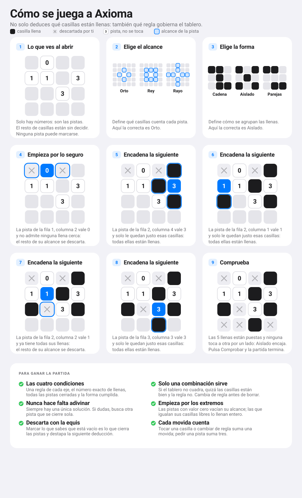

# Cómo se juega a Axioma

## En qué consiste

Axioma es un puzle de deducción. Un tablero cuadrado esconde un número fijo de
**celdas llenas**. Algunas casillas son **pistas**: llevan un número que dice
cuántas celdas llenas hay dentro de su alcance.

Hasta aquí se parece a un buscaminas. Lo que lo cambia todo es que **tampoco sabes
las reglas**. Antes de empezar hay que elegir dos:

- El **alcance**, que dice qué casillas mira cada pista.
- La **forma**, que dice cómo se agrupan entre sí las celdas llenas.

De todas las combinaciones posibles, **solo una tiene una solución válida**. Ese par
de reglas es el axioma del tablero, y descubrirlo es la mitad del juego.

No hay azar ni hace falta adivinar: cada tablero se genera comprobando que existe
una única solución contando todas las combinaciones de reglas a la vez. Si otra
combinación también encajara, el tablero se descarta antes de mostrártelo.

> Dentro del juego hay dos ayudas, una para cada momento. El botón **Cómo se juega**
> abre una explicación breve en cuatro pantallas, pensada para quien nunca ha
> jugado: de qué va, qué significa cada número, cómo se cruzan las reglas y cómo
> empezar. Es la que se abre sola la primera vez. El icono de interrogación junto al
> título abre la **guía detallada**, con las siete pantallas que recorren cada regla,
> una práctica interactiva y las condiciones exactas para ganar.

## Los pasos para empezar

1. **Abre el juego y mira el tablero.** Solo verás números. Cada número es una
   pista y no se puede marcar.
2. **Elige un alcance** entre Orto, Rey y Rayo. Al elegirlo, el tablero empieza a
   darte señales: las pistas que ya se cumplen se ponen verdes y las que se han
   vuelto imposibles, rojas.
3. **Elige una forma** entre Cadena, Aislado y Parejas.
4. **Toca las casillas.** Un toque la marca llena, otro la descarta con una equis,
   y un tercero la deja como estaba.
5. **Busca la primera deducción segura.** Una pista de valor cero vacía todo su
   alcance. Una pista cuyo número iguale las casillas libres que le quedan las
   llena todas.
6. **Encadena.** Cada casilla que resuelves cambia el estado de las pistas vecinas
   y destapa la siguiente deducción.
7. **Pulsa Comprobar** cuando tengas todas las llenas puestas.

Si al comprobar te dice que el tablero es correcto pero el par de reglas no,
significa que acertaste las casillas y fallaste la regla: cambia de regla, no de
casillas.

## El procedimiento, paso a paso

Este es un tablero real de cuatro por cuatro con cinco celdas llenas, resuelto
entero sin adivinar nada. La regla resulta ser **Orto con Aislado**, y las otras
tres combinaciones no tienen ninguna solución posible.

> Si la imagen no se ve en tu visor, abre [`public/como-jugar.svg`](public/como-jugar.svg)
> directamente. En la app publicada está en `/como-jugar.svg`.

## Qué hay que tener en cuenta para ganar

**La partida solo se da por buena si se cumplen las cuatro condiciones a la vez:**
una regla elegida en cada eje, el número exacto de celdas llenas, todas las pistas
cerradas, y la forma cumplida.

Estas son las ideas que más ayudan:

- **Empieza por los extremos.** Las pistas de valor cero y las que igualan sus
  casillas libres son las únicas que se resuelven solas. Búscalas primero.
- **Descarta de verdad, con la equis.** Marcar lo que sabes que está vacío no es
  decorativo: es lo que cierra una pista y hace visible la siguiente deducción. Una
  pista solo se pone verde cuando no le queda ninguna casilla sin decidir.
- **Si nada encaja, sospecha de la regla.** Antes de borrar medio tablero, prueba
  a cambiar el alcance o la forma. Las señales de color cambian al instante y
  suelen delatar cuál era la correcta.
- **Descarta combinaciones, no solo casillas.** Si con un alcance dado alguna pista
  se vuelve imposible desde el principio, ese alcance no es. Ese razonamiento vale
  tanto como resolver casillas.
- **Nunca hace falta adivinar.** Si te ves probando a ver qué pasa, es que hay una
  deducción que no has visto. El botón Pista te señala una.
- **Confía en la pantalla.** Si todas las pistas están verdes, la forma cumple y
  llevas el número exacto de llenas, has ganado: no existe otra configuración que
  ponga todo eso en verde.

**Sobre la puntuación.** Tocar una casilla o cambiar de regla suma una movida, y
pedir una pista suma tres. El mínimo teórico es una movida por cada celda llena,
más una por cada eje que ofrezca más de una opción. Alcanzarlo es una *partida
perfecta*. También se mide el tiempo, que arranca con tu primera jugada y se pausa
si sales de la pestaña.

---

La especificación completa de las reglas, con todos sus valores exactos, está en
[GAME.md](GAME.md).
